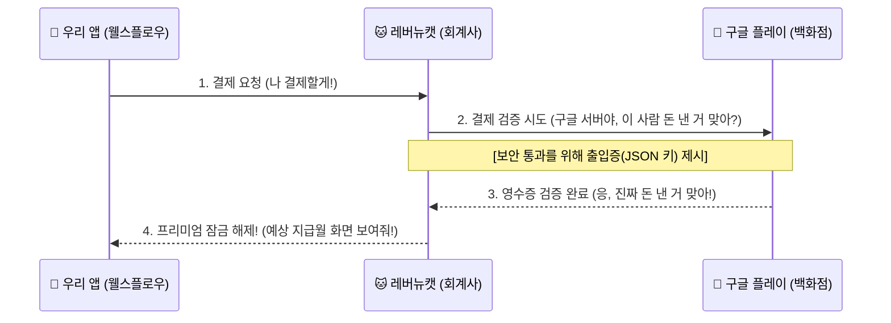

# 웰스플로우(Wealth Flow) 인앱 결제 구조 및 작업 내역 가이드 📜

구글 플레이 콘솔, 구글 클라우드, 레버뉴캣... 이름도 비슷하고 화면도 복잡해서 헷갈리셨죠? 
각 서비스의 **실제 접속 주소(URL)**와 함께, 오늘 각각의 시스템에서 **사용자님과 제가 직접 조율한 실제 작업 내역**을 하나하나 매칭하여 쉽게 정리해 드립니다.

---

## 1. 세 가지 시스템의 핵심 개념 및 실제 작업 내역

우리가 연동한 시스템은 **"구글 백화점 본사"**, **"백화점 보안실"**, **"전문 세무/회계 대행사"**가 협력하여 일하는 구조입니다.

### ① 구글 플레이 콘솔 (Google Play Console)
* 🔗 **실제 주소**: [https://play.google.com/console/](https://play.google.com/console/)
* 🏢 **역할 (백화점 본사 및 매장)**:
  - 우리 앱을 진열하여 사람들이 다운로드받을 수 있게 해주는 상점 플랫폼입니다.
* 🛠 **우리가 오늘 완료한 실제 작업**:
  - **인앱 상품 등록**: `[Play를 통한 수익 창출]` -> `[제품]` -> `[일회성 제품]` 메뉴에서 가격 **4,900원**의 **`wealth_flow_premium_lifetime` (평생 소장권)** 상품을 생성하고 **[활성화]** 완료했습니다.
  - **대리인 이메일 승인**: `[사용자 및 권한]` 메뉴에 회계사 이메일(`revenuecat@gen-lang-client-0864952146.iam.gserviceaccount.com`)을 활성 상태 직원으로 이미 등록 완료해 두었음을 확인했습니다.
  - **테스트 앱 배포**: 버전 코드 **`2`**로 정식 릴리즈 서명된 최종 앱 파일(`app-release.aab`)을 `[내부 테스트]` 트랙에 성공적으로 출시 완료했습니다.

---

### ② 구글 클라우드 콘솔 (Google Cloud Console)
* 🔗 **실제 주소**: [https://console.cloud.google.com/](https://console.cloud.google.com/)
* 🔑 **역할 (백화점 보안실 및 출입증 발급소)**:
  - 구글의 모든 서버 보안과 가상 직원 계정을 통제하는 보안소입니다.
* 🛠 **우리가 오늘 완료한 실제 작업**:
  - **프로젝트 및 API 활성화**: **`Default Gemini Project`** 프로젝트 내에서 구글 플레이와 소통하기 위한 **`Google Play Android Developer API`**가 활성화되어 있는지 검증했습니다.
  - **출입증(JSON 키) 신규 발급**: 가상 직원(`revenuecat@gen-lang-client-...`)에 로그인하기 위해, `[IAM 및 관리자]` -> `[서비스 계정]` -> `[키 관리]` 메뉴에서 **새로운 비밀번호(JSON 키 파일)**를 컴퓨터로 다운로드 받았습니다.

---

### ③ 레버뉴캣 (RevenueCat)
* 🔗 **실제 주소**: [https://app.revenuecat.com/](https://app.revenuecat.com/)
* 🧾 **역할 (결제/회계 관리 대행사)**:
  - 구글 플레이에 손님이 진짜로 결제했는지 장부를 대조하고 검증해서 앱의 프리미엄 잠금을 열어주는 일꾼입니다.
* 🛠 **우리가 오늘 완료한 실제 작업**:
  - **출입증 전달 (영수증 검증 연결)**: 레버뉴캣의 `[Apps]` 메뉴에서 `wealthflow (Play Store)`를 클릭하여, 방금 구글 클라우드에서 발급받은 **새로운 JSON 열쇠 파일**을 업로드하여 구글 서버와 **`Valid credentials` (인증 성공)** 상태를 완성했습니다.
  - **결제 키 발급 및 앱 코드 적용**: 레버뉴캣 `[API keys]` 메뉴에서 고유 결제 키 **`goog_YugkYTfxkNyGuqsUUXHScHDTANb`**를 복사한 후, 우리 플러터 소스코드(`lib/payment_service.dart`)에 직접 주입했습니다.

---

## 2. 결제 시스템 작동 흐름도 (Sequence Diagram)

---

## 3. 오늘 우리가 함께 완료한 작업의 타임라인 (순서 단계별 내역)

오늘 발생했던 문제들과 그 해결 과정은 아래 순서대로 꼼꼼히 실행되었습니다.

* **[1단계] 첫 출시 실패 (디버그 키 문제)**
  - 처음 개발 버전 그대로 구글 콘솔 내부 테스트에 업로드했을 때, 콘솔에서 **"디버그 모드로 서명한 APK 또는 Bundle을 업로드했습니다. 출시 모드로 서명해야 합니다."**라는 거부 에러가 떴습니다.
* **[2단계] 릴리즈 전용 서명 키 제작 및 Gradle 주입**
  - 이를 해결하기 위해 맥 터미널에서 구글 연동 정식 서명 키 파일(`upload-keystore.jks`)을 새로 생성했습니다.
  - 생성된 키 정보를 앱 빌드 설정 파일(`android/key.properties`, `android/app/build.gradle.kts`)에 입력하여, 앱을 다시 빌드할 때 자동으로 구글 릴리즈 서명이 새겨지도록 코딩했습니다.
* **[3단계] 첫 업로드 성공 (버전 1)**
  - 정식 서명된 버전 1 빌드 파일을 플레이 콘솔 내부 테스트에 업로드하여 **구글의 보안 심사 규격을 최초 통과**시켰습니다.
* **[4단계] 인앱 결제 상품 등록**
  - 결제 시스템을 작동시키기 위해, 플레이 콘솔 내에 4,900원짜리 일회성 제품인 **`wealth_flow_premium_lifetime`** 상품을 활성화하여 진열 완료했습니다.
* **[5단계] 구글 클라우드 보안 열쇠(JSON) 신규 발급**
  - 구글 클라우드 콘솔의 서비스 계정 메뉴로 들어가, 구글 플레이가 회계사(레버뉴캣)의 조회를 허가해 주는 비밀 열쇠 파일인 **JSON 파일을 새로 다운로드** 받았습니다.
* **[6단계] 레버뉴캣에 열쇠 등록**
  - 레버뉴캣의 안드로이드 앱 설정 화면으로 이동하여, 새로 다운로드한 JSON 파일을 업로드해 **`Valid credentials` (초록색 인증 성공)**을 따냈습니다.
* **[7단계] 앱 코드에 실제 결제 키 입력**
  - 레버뉴캣 API keys 메뉴에서 생성된 SDK 결제 키(`goog_YugkYTfxkNyGuqsUUXHScHDTANb`)를 확인하고, 우리 플러터 소스코드 `lib/payment_service.dart`의 `_googleApiKey` 부분에 붙여넣었습니다.
* **[8단계] 버전 코드 상향 (버전 1 ➔ 버전 2)**
  - 결제 키가 바뀐 신버전을 스토어에 재업로드하기 위해 `pubspec.yaml` 및 `android/local.properties`의 버전 코드를 기존 1에서 **`2`**로 상향 설정했습니다. (구글은 동일 버전 업로드를 금지하므로 필수적인 작업)
* **[9단계] 최종 배포 (버전 2 완료)**
  - 버전 2로 다시 조립한 최종 릴리즈 AAB 파일을 빌드하여 구글 플레이 콘솔 `[라이브러리에서 추가]`를 통해 내부 테스트 배포 트랙에 최종 출시 성공하였습니다.
* **[10단계] 무료 결제용 라이선스 테스트 및 테스터 설정 완료**
  - 플레이 콘솔 `[설정]` -> `[라이선스 테스트]` 메뉴에서 와이프분의 구글 계정(Gmail)을 등록하고 모의 승인 설정(`LICENSED`)을 완료하여 테스트 중 실제 돈이 청구되는 문제를 방지했습니다.
  - 플레이 콘솔 `[내부 테스트]` -> `[테스터]` 설정창에 와이프분의 이메일 목록을 지정하여 비공개 앱 스토어에 대한 온전한 다운로드 권한을 부여했습니다.
* **[11단계] 비공개 테스트 링크 전송 완료**
  - 구글 서버로부터 발급받은 테스터 참여 전용 고유 링크 주소 복사를 마쳤고, 오늘 테스트를 진행할 와이프분 핸드폰으로 성공적으로 발송을 완료했습니다.
* **[12단계] 레버뉴캣 상품 카탈로그 매핑 및 구글 플레이 스토어 제품 연결 완료 (최종 해결) 🆕**
  - 기존 레버뉴캣의 `Test Store` 가상 상품에 임시 매핑되어 구글 결제창이 호출되지 않던 문제를 해결했습니다.
  - 레버뉴캣 `[Products]` 메뉴에 구글 플레이 전용 실상품 ID인 `wealth_flow_premium_lifetime`을 비소모성(`Non-consumable`) 유형으로 신규 등록하였습니다.
  - 생성된 실상품을 레버뉴캣 권한(`premium` 및 `wealthflow Pro`)에 연결(`Attach`)하여 결제 성공 시 프리미엄 잠금 해제가 즉각 이루어지도록 설정했습니다.
  - 레버뉴캣 오퍼링(`default` 오퍼링)의 `Lifetime` 패키지 설정에 들어가 기존 가상 테스트 상품을 연결 해제(`Detach` ➔ 가상 상품 삭제 처리)하고, 새로 등록한 실상품(`wealth_flow_premium_lifetime`)을 연결(`Attach product`)해 최종 저장하였습니다.
  - 결과적으로 와이프분 핸드폰에서 결제 호출 시 **4,900원 구글 정식 모의 결제창**이 에러 없이 완벽하게 뜨도록 처리를 완수했습니다.

---

## 4. 📱 오늘 저녁 와이프분 핸드폰(안드로이드) 결제 테스트 가이드

와이프분이 링크를 누르면 진행할 설치 및 최종 결제 테스트 순서입니다.

1. **테스트 프로그램 가입**: 와이프분 폰으로 받은 링크에 접속한 뒤 화면에 나타나는 **`[테스트 프로그램 참여]`** (또는 `BECOME A TESTER`) 버튼을 누릅니다.
2. **플레이 스토어 이동**: 가입 완료 메시지와 함께 하단에 생성되는 **`[Google Play에서 다운로드]`** 파란색 텍스트 링크를 클릭합니다.
3. **진짜 앱 설치**: 구글 플레이 스토어로 연결되며, 일반 앱 다운로드와 똑같이 **`[설정]`** (또는 `설치`) 버튼을 눌러 와이프분 폰에 진짜 웰스플로우 앱을 설치합니다.
4. **4,900원 상품 결제**: 앱을 실행해 프리미엄 가입창에 진입한 뒤 평생 소장권 결제하기 버튼을 탭합니다.
5. **모의 결제 확인 및 승인**: 결제창 팝업이 뜨면 결제 수단 부분에 **`[테스트 카드(결제 시 실제 청구 안 됨)]`** 문구가 표시되는지 확인하고, 비밀번호를 입력해 결제를 마칩니다. 
6. **기능 해제 검증**: 즉시 프리미엄 캘린더 분석 뷰의 자물쇠가 풀리며 데이터가 원활히 연동되어 표출되는지 최종 검증합니다!
